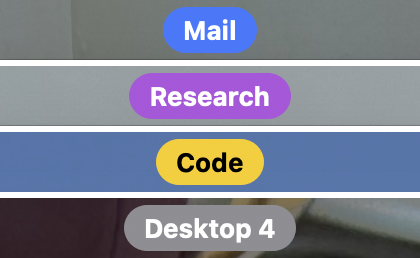
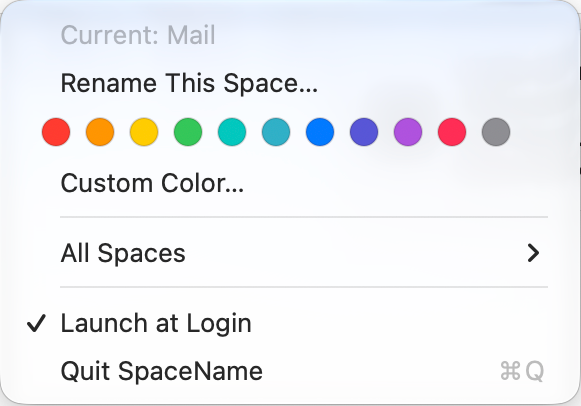

# SpaceName

macOS won't let you rename desktop Spaces. SpaceName puts a name and color for the current Space at the top center of the menu bar.



- One label per Space, with its own name and color. Unnamed Spaces show `Desktop N`.
- Labels stay with their Space when Spaces are reordered in Mission Control.
- Clicks pass straight through the label.
- Rename or recolor any Space from the menu bar icon, without switching to it.
- Each display shows the label for its own current Space.
- Menu-bar-only: no Dock icon. Launches at login (toggle in the menu).



## Requirements

- macOS 14 or later
- Xcode 16+ and [XcodeGen](https://github.com/yonaskolb/XcodeGen) (`brew install xcodegen`)

## Build and install

```sh
xcodegen generate
xcodebuild -project SpaceName.xcodeproj -scheme SpaceName -configuration Release -derivedDataPath build build
cp -R build/Build/Products/Release/SpaceName.app /Applications/
open /Applications/SpaceName.app
```

The build is ad-hoc signed by default, which is fine for running it on your own Mac. To sign with your Apple Developer team instead, copy `Local.xcconfig.example` to `Local.xcconfig` (it's git-ignored), fill in your Team ID, regenerate, and add `-allowProvisioningUpdates` to the build command.

## How it works

macOS has no public API for identifying the current Space, so SpaceName uses the private `CGSCopyManagedDisplaySpaces` call, the same approach used by yabai, WhichSpace and similar tools. That means:

- It can't be distributed on the Mac App Store.
- A future macOS update could change the private API. If that happens, the label hides and the menu shows "Space detection unavailable" rather than crashing.

The app needs no permissions, makes no network requests, and stores labels only in its own local preferences (`com.cohren.SpaceName`).

The label updates when macOS reports that the Space has changed, which is at the end of the switch animation.

See [SPEC.md](SPEC.md) for the full design.

## License

[MIT](LICENSE)
